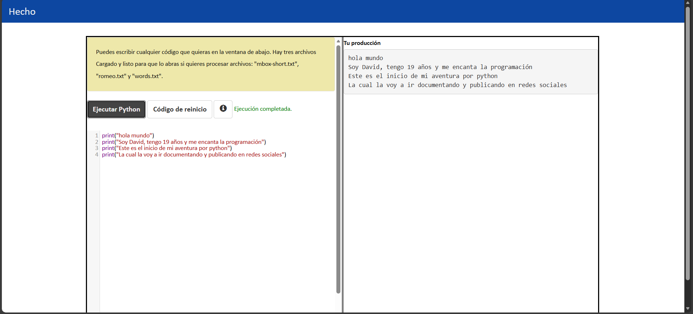
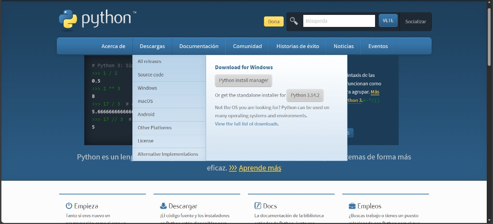
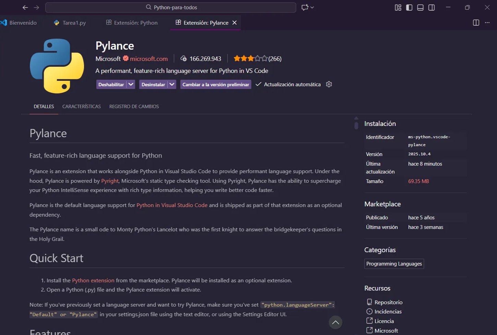
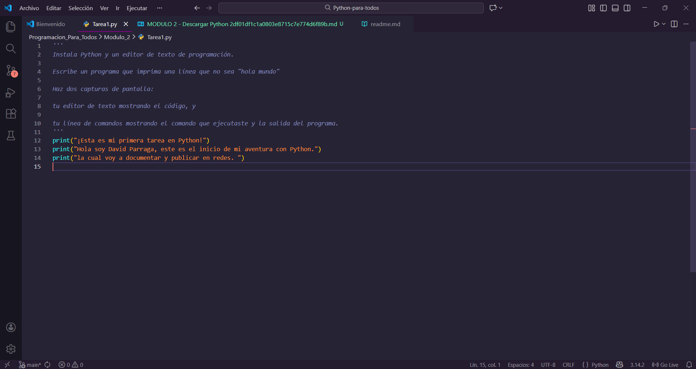

# MODULO 2 - Descargar Python .

# ¿Python **Playground**?

En el Módulo 2 se presenta el Python Playground, una herramienta que permite escribir y ejecutar programas de Python directamente en el navegador sin necesidad de instalar el software en tu computadora



# 🛠️ Resumen de Configuración del Entorno de Desarrollo (Python):

## ¿Como descargar Python?



Antes de cualquier herramienta visual, se instaló el intérprete base.

- **Fuente:** Descarga oficial desde
    
    [Welcome to Python.org](https://www.python.org/)
    
- **Paso Crítico:** Durante la instalación en Windows, se marcó la casilla obligatoria:
    
    <aside>
    💻 Add python.exe to PATH
    
    </aside>
    
    **¿Por qué?** Para que la terminal (consola) reconozca el comando python desde cualquier carpeta.

- **Verificación:** Se comprobó la instalación exitosa ejecutando en la terminal:
    
    
    

## **Visual Studio Code:**

VS Code sera el editor de código que se usara para escribir todo el código del proyecto, aqui abajo el link a su pagina de descarga 👇: 

[](https://code.visualstudio.com/)

Instalación de las extensiónes oficial **Python (de Microsoft)** desde el Marketplace.

1. **Python**:
    
    


2. **Pylance**:
    
    
    

3. **Python Debugger**:
    
    
    

## Primer Programa En Python:

Esta tarea no era calificada y no había forma de subir evidencia pero de igual manera presento mi código. 

```python
'''
Instala Python y un editor de texto de programación.

Escribe un programa que imprima una línea que no sea "hola mundo"

Haz dos capturas de pantalla:

tu editor de texto mostrando el código, y

tu línea de comandos mostrando el comando que ejecutaste y la salida del programa.
'''
print("¡Esta es mi primera tarea en Python!")
print("Hola soy David Parraga, este es el inicio de mi aventura con Python.")
print("la cual voy a documentar y publicar en redes. ")

```

