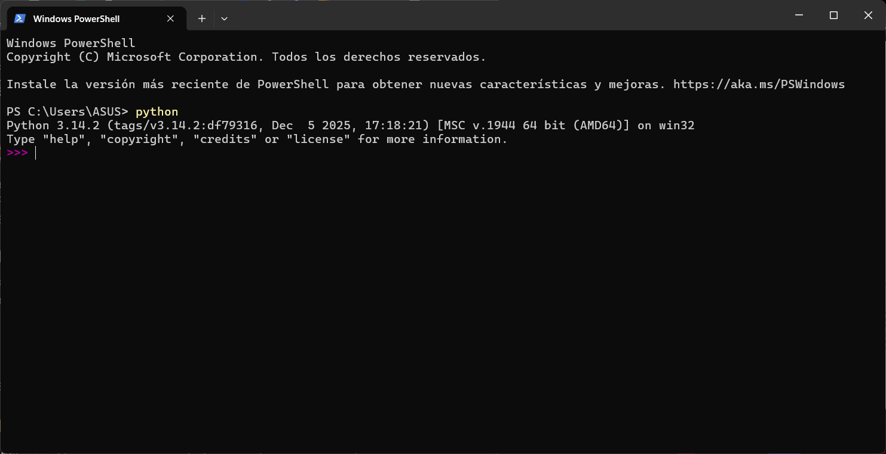
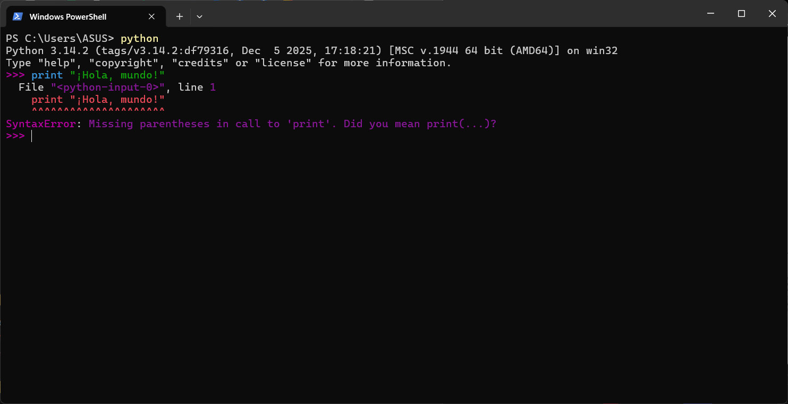
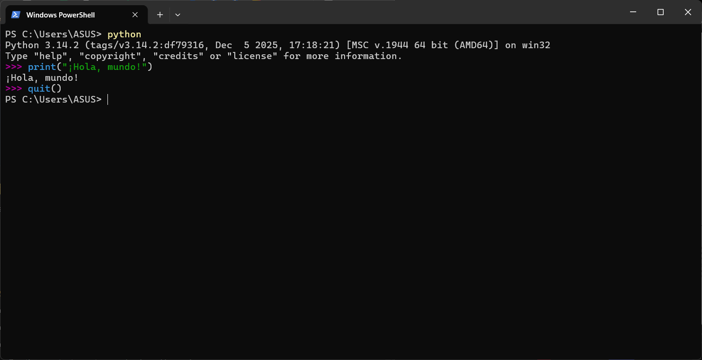

# Conversando con Python.


# 🎯 Lo Esencial

Python es como un intérprete que espera tus instrucciones. Para comenzar a "conversar" con él, necesitas usar su lenguaje: comandos y sintaxis específicos.



## 💬 Tu Primera Palabra: print()

La función más básica para comunicarte con Python es `print()`. Con ella, le dices a Python que muestre un mensaje:

```python
print("¡Hola, mundo!")
```


## ⚠️ Python es Estricto

Python es muy preciso con la sintaxis. Un pequeño error y recibirás un mensaje de `SyntaxError`. No te preocupes, ¡es parte del aprendizaje!



## 👋 Despidiéndote

Para salir del intérprete de Python correctamente, simplemente escribe:

```python
quit()
```



## ✨ Recuerda

- Python espera comandos precisos y bien escritos
- Usa `print()` para mostrar mensajes
- Los errores son normales y te ayudan a aprender
- Practica constantemente para dominar el lenguaje