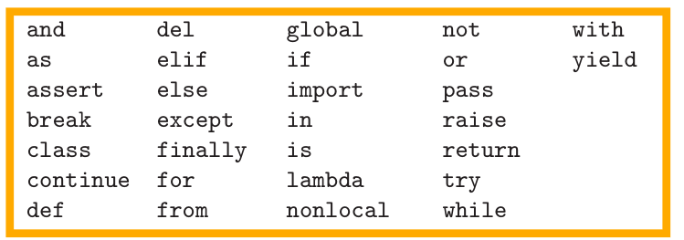
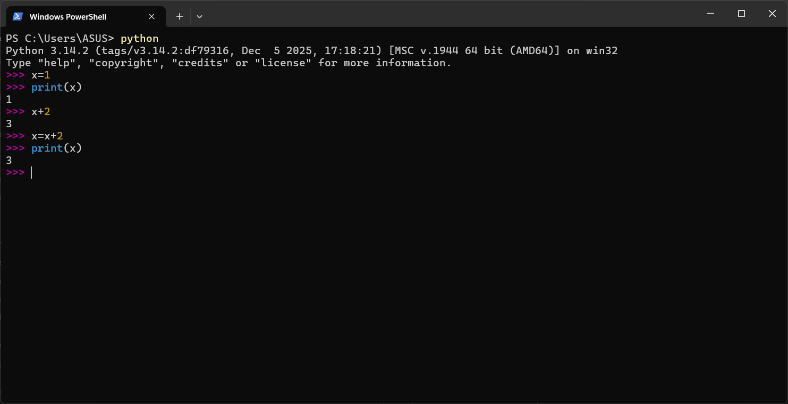
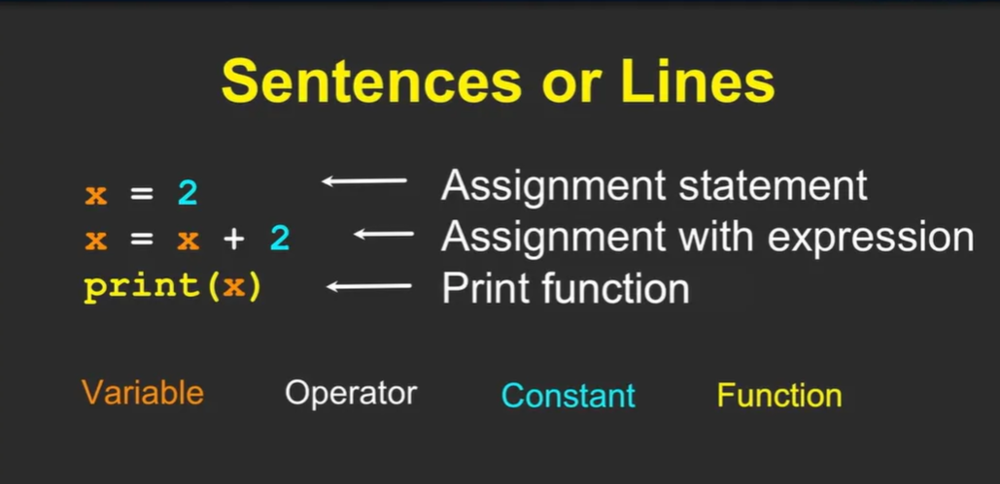

# Módulo 3 - Palabras Reservadas.

# 1. Palabras reservadas:

A diferencia de los lenguajes humanos, el **vocabulario de `Python`** es en realidad bastante reducido. Llamamos a este “**vocabulario**” las **`palabras reservadas`**. Se trata de palabras que tienen un significado muy especial para Python. 

Dr. Chuck compara a Python con un perro. Puedes decirle muchas cosas ("bla bla bla") y no entenderá, pero si dices una palabra reservada como "Paseo", reaccionará inmediatamente.

>💻
>Cuando escribas programas, podrás usar tus propias palabras con significado, que reciben el nombre de `variables.`  
>`No podrás` utilizar ninguna de las palabras reservadas de Python como nombre de una variable.

</aside>




## 1.1. ¿Qué es una Variable?

Una **`variable`** en programación es un **espacio reservado en la memoria** de la computadora donde podemos **almacenar información** que necesitamos usar más tarde en nuestro programa.

### Analogía del Casillero

Imagina que la memoria de la computadora es como un enorme depósito lleno de casilleros. Cuando creas una variable, estás:

1. Reservando uno de esos casilleros
2. Poniéndole una etiqueta con un nombre (el nombre de tu variable)
3. Guardando algo dentro (el valor de la variable)

### Ejemplo en Python

```python
x = 5
nombre = "David"
precio = 19.99
```

En estos ejemplos:

- **`x`** es el nombre del casillero (variable) y **`5`** es lo que guardamos dentro
- **`nombre`** es otra variable que guarda el texto **`"David"`**
- **`precio`** guarda el número decimal **`19.99`**

### Características Importantes

- **`Reutilizables`:** Puedes usar el mismo nombre de variable muchas veces en tu programa
- **`Modificables`:** El contenido de una variable puede cambiar durante la ejecución del programa
- **`Tienen un tipo:`** Pueden guardar números, texto, listas, etc.


>**💡 Recuerda:**   
>Cuando le das un nombre a una variable, estás creando una "etiqueta" para encontrar fácilmente ese espacio de memoria donde guardaste tu información.

# 2. Elementos de Python:

El Dr. Chuck introduce la programación en Python como el acto de "conversar" con la computadora. Python actúa como un intérprete que espera instrucciones precisas para ejecutar tareas, ya que, aunque poderoso, no sabe qué hacer hasta que tú se lo indicas.

### **Ejecutar Python en la Terminal:**

- Al iniciar Python en la terminal, aparece el símbolo **`>>>`** Esto indica que Python está listo para escuchar.
- Es útil para pruebas rápidas (3-4 líneas), pero si cometes un error, debes empezar de nuevo.
- **La Sentencia de Asignación (x = 1)**

>💻
>Dr. Chuck explica que el signo igual (=) tiene una dirección. No es una equivalencia matemática, sino una instrucción para reservar un espacio en la memoria.   



### **La Analogía del Lenguaje → De Palabras a Historias:**

Para aprender Python, se sigue un proceso similar al de aprender un idioma humano:

>👨🏻‍🏫  
>**Vocabulario:** Son las variables y palabras reservadas.
>**Oraciones:** Son las líneas de código (sintaxis válida).
>**Párrafos:** Bloques de código que trabajan juntos.
>**Historia:** El programa completo (Script) que resuelve un problema.

### **Archivos `.py`:**

- Escribir código línea por línea en la terminal es tedioso para programas largos.
- Para solucionar esto, escribimos **Scripts**: archivos de texto guardados con la extensión .py.
- Esto equivale a entregarle a Python la "historia completa" de una sola vez para que la lea y ejecute de principio a fin.

