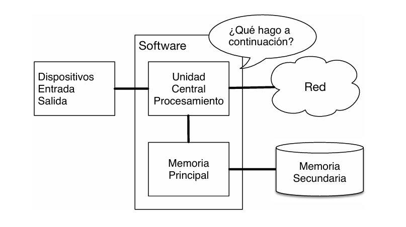

# ¿Por qué deberías aprender a escribir programas?

# 1. **La programación como herramienta universal:**

`Dr. Chuck` explica que programar no es solo para ingenieros: es una habilidad que permite a cualquier persona automatizar tareas, analizar datos y crear soluciones personalizadas.

Programar nos da la capacidad de transformar instrucciones en acciones que una computadora puede ejecutar. Esto significa que podemos resolver problemas cotidianos de manera más eficiente.

Podemos pensar en las **`computadoras`** como nuestros “asistentes personales”, que pueden ocuparse de muchas tareas por nosotros. El hardware en los equipos que usamos cada día está diseñado esencialmente para hacernos la misma pregunta de forma constante:   

  
    

>💻
>¿Qué quieres que haga ahora?

Si tan solo supiéramos qué idioma utilizar para explicarle a la computadora qué es lo que queremos que **`haga ahora`** podríamos pedirle que realizase en nuestro lugar tareas repetitivas.

El hecho de que los computadores sean buenos en aquellas cosas en las que los humanos no lo son es el motivo por el que necesitas aprender a hablar el **`idioma de las computadoras.`**

La Unidad Central de Procesamiento (CPU) es capaz de preguntar esto miles de millones de veces por segundo.       

Como humanos, no podemos hablar lo suficientemente rápido para responder a esa velocidad. Por ello, debemos escribir las instrucciones por adelantado; esas instrucciones almacenadas son lo que llamamos **`programa`**.

Al programar, asumes el papel de quien orquesta los recursos (CPU, memoria, red) para resolver problemas.

ARQUITECTURA HARDWARE DE LAS COMPUTADORAS

## **Eficiencia en el manejo de datos**

Los humanos y las computadoras tienen habilidades opuestas. Mientras que la mente humana puede leer y comprender el contexto de un texto rápidamente. 

Para una **`computadora`**, es lo contrario: entender el texto es difícil, pero **`contar palabras` o `buscar patrones repetitivos` es extremadamente `sencillo` y `rápido`**.

>💻  
>Aprender a programar te ahorra tiempo en tareas tediosas, como buscar una palabra específica en millones de líneas de texto, algo que te llevaría mucho menos tiempo automatizar con Python que hacer manualmente.

## **Cambio de rol: De usuario a creador**

 Generalmente, interactuamos con computadoras usando programas creados por otros, donde los programadores conducen la conversación y nosotros somos los usuarios. Aprender a programar te permite:

- **`Dejar de ser solo un usuario final`** para convertirte en **programador y usuario de tus propias herramientas**.
- **`Adquirir habilidades`** para manejar datos e información a lo largo de tu vida, lo cual es útil incluso si tu objetivo no es ser informático, sino aplicar la tecnología en otros campos (la biología, la economía o la abogacía).

