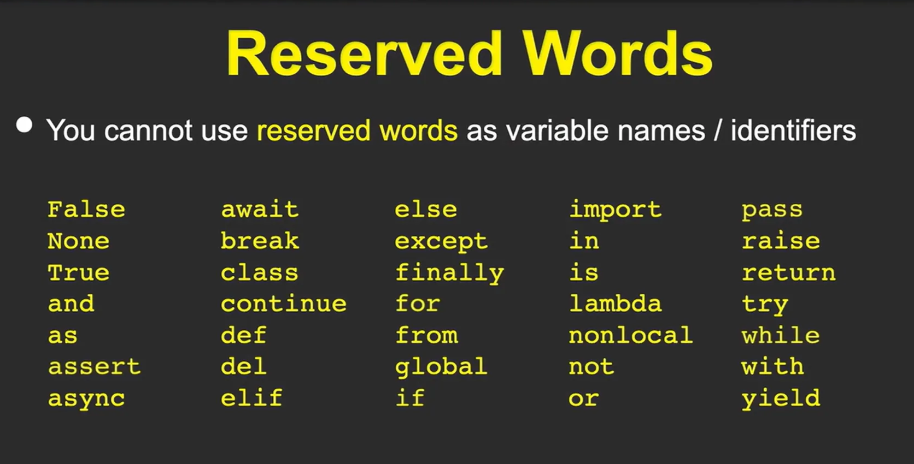
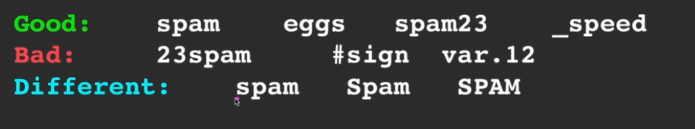

# Constantes, palabras reservadas y variables

# Los Átomos de Python

En esta lección, el profesor Charles Severance (Dr. Chuck) profundiza en los componentes fundamentales o "pequeños fragmentos" que componen el lenguaje Python, antes de escribir un programa completo. Se centra en tres conceptos clave:

## **`1.Constantes:`**

Son valores fijos que no cambian a lo largo de la ejecución.

- **Numéricas:** Números enteros (`123`) o de punto flotante (`98.6`).
- **Cadenas (Strings):** Textos encerrados en comillas simples o dobles (ej. `'Hello world'`).

## **`2.Palabras Reservadas:`**

Son palabras que tienen un significado especial y estricto para Python. El profesor usa la analogía del "lenguaje de perro" (comandos específicos que el perro entiende perfectamente).

- Ejemplos: `class`, `else`, `if`, `import`, `break`.
- **Regla de oro:** No puedes usar estas palabras para nombrar tus propias variables.

## **`3. Variables:`**

Son espacios nombrados en la memoria del computador donde el programador puede almacenar datos y recuperarlos más tarde.

- **Control:** Tú eliges el nombre de la variable (etiqueta).
- **Sentencia de Asignación (`=`):** El símbolo igual en Python no significa igualdad matemática, sino una **flecha de dirección**.
    - Ejemplo: `x = 12.2` significa "Busca un espacio de memoria, etiquétalo como 'x' y guarda el valor 12.2 allí".
    - Son mutables: Si luego escribes `x = 100`, el valor anterior se borra y se actualiza con el nuevo.

### **`3.1.Reglas para nombrar variables:`**

- **Permitido:** Deben comenzar con una letra o un guion bajo (`_`). El resto puede contener letras, números y guiones bajos.
- **Sensibilidad:** Python distingue mayúsculas de minúsculas (`spam`, `Spam` y `SPAM` son variables diferentes), aunque se recomienda usar minúsculas para evitar confusiones.
- **Prohibido:** No pueden empezar con números ni contener caracteres especiales (como `#`).

