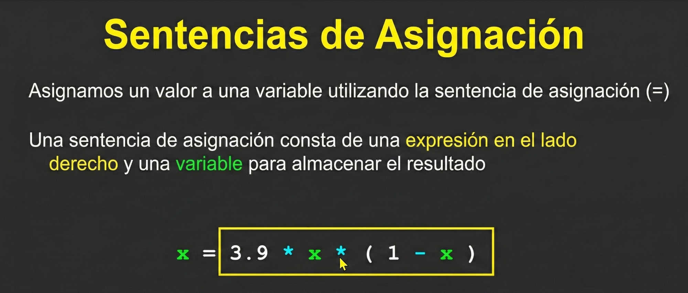

# Nombres de Variables y Asignación

Status: Modulo 4

# `Variables Mnemotécnicas` y `Sentencias de Asignación`

En esta continuación, el Dr. Chuck profundiza en la filosofía detrás de cómo nombrar variables y la mecánica técnica de cómo Python procesa la información.

## 1. La Importancia de los Nombres de Variables (Mnemotecnia)

El profesor introduce el concepto de **mnemotecnia** (ayudas para la memoria) aplicado a la programación. Aunque Python te da la libertad de elegir cualquier nombre para tus variables (siguiendo las reglas de sintaxis), enfatiza dos perspectivas muy diferentes:

- **`La perspectiva de Python:`** A Python **no le importa** el nombre que elijas. Para el intérprete, una variable llamada `horas` es tratada exactamente igual que una llamada `asqs2ws3wd2312sw`. No entiende el contexto ni el significado humano de las palabras.
- **`La perspectiva del Humano:`** Para ti (y para otros programadores que lean tu código), el nombre es crucial. Un código con variables crípticas (ej. `x1q3z9ocd`) es técnicamente correcto pero **ilegible**.

## **El Ejemplo Comparativo:**

El profesor muestra un bloque de código que calcula un salario.

1. **`Versión ilegible:`** Usa variables con letras aleatorias. El código funciona y calcula el resultado correcto, pero es imposible saber qué hace a simple vista.
2. **`Versión limpia:`** Usa variables como `a`, `b` y `c`. Es mejor, pero sigue siendo ambiguo.
3. **`Versión Mnemotécnica:`** Usa `horas`, `tarifa` y `pago`. Ahora el código se explica por sí mismo.

# 2. Sentencias de Asignación (`=`)

El video profundiza en cómo funciona realmente el signo igual.

- **No es igualdad matemática:** En matemáticas, `=` implica que ambos lados son idénticos. En programación, es una **flecha de dirección** (←).
- **El flujo de la asignación:** Siempre ocurre de **derecha a izquierda**.
    1. **`Lado Derecho (Expresión):`** Python primero ignora el lado izquierdo. Mira a la derecha, busca los valores actuales de las variables en memoria y resuelve la operación matemática hasta reducirla a un solo valor.
    2. **`Lado Izquierdo (Variable):`** Una vez que tiene el resultado, busca la ubicación de memoria etiquetada con el nombre del lado izquierdo y deposita el nuevo valor allí.
    3. **`Destrucción:`** Este proceso es destructivo; el valor antiguo que tenía la variable se borra y es reemplazado por el nuevo.
    
    
    

## 3. La Paradoja Matemática (`x = x + 1`)

El profesor explica una de las líneas más comunes en programación que confunde a quienes vienen de las matemáticas puras:

>👨🏻‍🏫  
>x = x + 1

</aside>

- En matemáticas, esto es imposible.
- En programación, es una instrucción de **incremento**.
    
    >👨🏻‍🏫  
    >Significa: "Toma el valor *actual* de `x`, súmale 1, y guarda el resultado *de nuevo* en `x`".
    
    </aside>
    
- Esto demuestra que la variable puede estar en ambos lados de la ecuación porque los lados ocurren en momentos diferentes (primero se evalúa la derecha, luego se asigna a la izquierda).