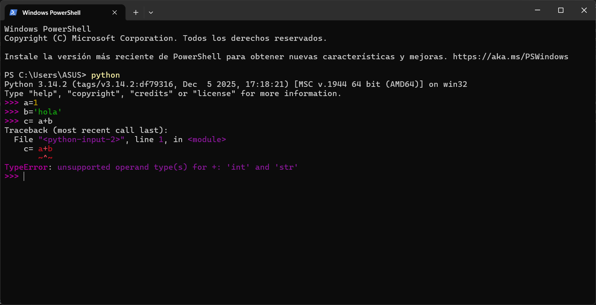
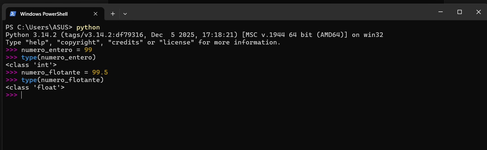
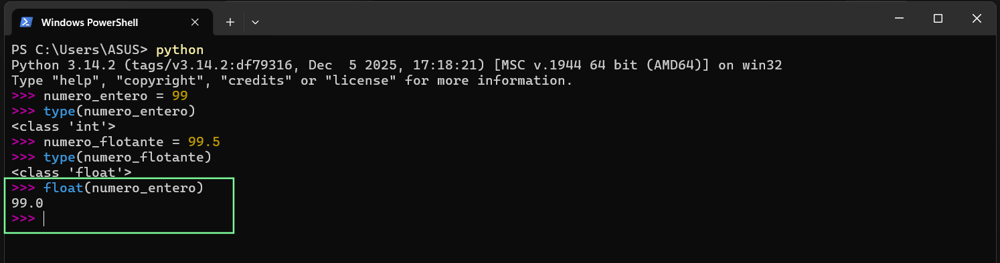
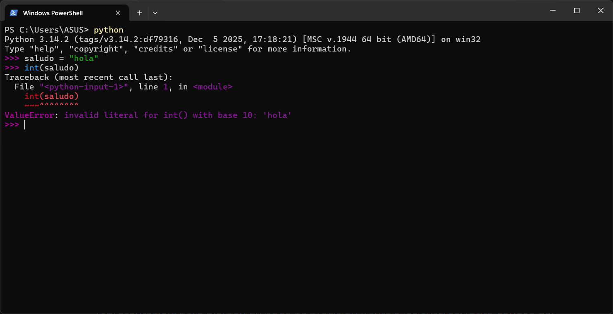

# Tipos de Datos y comentarios:

# Tipos de Datos, Expresiones y Entradas de Usuario

## **1. La importancia de los Tipos de Datos:**

- Python rastrea meticulosamente no solo el valor de una variable, sino también su tipo
- El significado de los operadores cambia según el tipo de dato.
    
    Por ejemplo, el operador `+` realiza una **`suma matemática`** si los operandos son números enteros por ejemplo `1 + 4 = 5`.
    
    Pero realiza una **`concatenación`** si los operandos son cadenas de texto o strings por ejemplo `'hola ' + 'mundo' = 'hola mundo'`).
    

## **2. Errores de Tipo y Tracebacks**

- Si intentas mezclar tipos de datos de forma incompatible como sumar el número `1` a la cadena `'hola'`, Python se confunde, detiene la ejecución del programa y arroja un error llamado **Traceback,** específicamente un `TypeError`.
    
    
    

## **3. Funciones Útiles: `type()`, `float()` e `int()`**

- **`type()`**: Te permite preguntarle a Python qué tipo de dato es una variable o constante en un momento dado.
    
    
    

- `Conversión de tipos:` Puedes forzar la conversión de un tipo a otro. Por ejemplo, usar **`float(99)`** lo convierte a `99.0`.  Usar **`int('123')`** convierte la cadena de texto a un valor matemático real.

    

- **Precaución**: Si intentas usar `int()` en una cadena que no contiene números (como `'hello'`), Python arrojará un error (`ValueError`).
    
    
    

## **4. Números: Enteros vs. Punto Flotante**

- **`Integers (Enteros):`** Números perfectos sin decimales.
- **`Floating Point (Flotantes)**:` Números con decimales. Tienen un rango mucho mayor de representación, pero pierden un poco de precisión frente a los enteros.
    
    <aside>
    👨🏻‍🏫
    
    Nunca uses flotantes para calcular dinero
    
    </aside>
    

## **5. Interactuando con el usuario: `input()`**

- La función **`input('Mensaje:')`** pausa el programa y le permite al usuario escribir algo a través del teclado.
- **Regla de oro**: **`input()`** **siempre** devuelve lo que el usuario escribió en formato de **String** (cadena de texto). Si le pides la edad a un usuario y escribe **`25`**, Python lo lee como el texto **`'25'`**. Si necesitas hacer cálculos con eso, deberás convertirlo previamente usando **`int()`** o **`float()`**.

# Comentarios y Documentación del Código

## **1. El uso de la almohadilla / numeral (`#`)**

- Cualquier texto que escribas a la derecha de un símbolo `#` será completamente ignorado por Python. A esto se le llama **`comentario`**.

## **2. ¿Para qué sirven los comentarios?**

- **`Explicar intenciones:`** Describir en lenguaje humano qué va a pasar en un bloque o secuencia de código (como si fueran los títulos de un párrafo).
- **`Documentar:`** Dejar claro quién escribió el código o añadir contexto importante.
- **`Debugging (Depuración):`** Sirve para "apagar" o deshabilitar temporalmente una línea de código si estás intentando encontrar un error sin tener que borrarla permanentemente.

## **3. ¿Para quién son los comentarios?**

- Principalmente **`para tu "yo" del futuro`**. En unos meses, cuando vuelvas a leer tu propio código, no recordarás por qué tomaste ciertas decisiones. Los comentarios te ahorran dolores de cabeza.
- **Buenas prácticas**: No escribas comentarios obvios para cosas que el código ya dice claramente (por ejemplo, escribir **`# esto asigna 1 a x`** encima de **`x = 1`**). Usa los comentarios para explicar el "por qué" o resumir lógicas complejas.