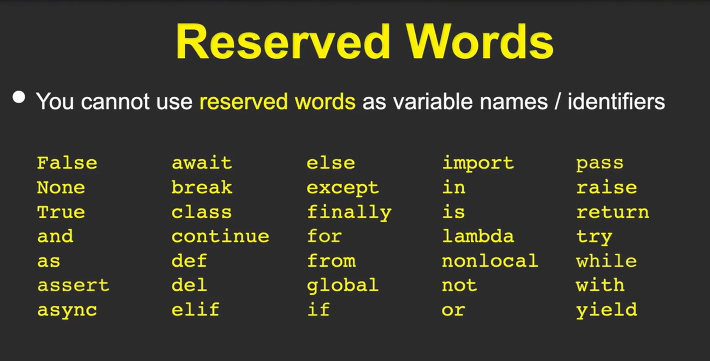

# 1.4 … 1.5. Conversando con Python.

Capitulo del libro: Capítulo 1

# 1.4 Palabras y frases:

A diferencia de los lenguajes humanos, el **vocabulario de `Python`** es en realidad bastante reducido. Llamamos a este “**vocabulario**” las **`palabras reservadas`**. Se trata de palabras que tienen un significado muy especial para Python. 

Dr. Chuck compara a Python con un perro. Puedes decirle muchas cosas ("bla bla bla") y no entenderá, pero si dices una palabra reservada como "Paseo", reaccionará inmediatamente.

<aside>
💻

Cuando escribas programas, podrás usar tus propias palabras con significado, que reciben el nombre de `variables.` 

`No podrás` utilizar ninguna de las palabras reservadas de Python como nombre de una variable.

</aside>




# 1.5. Conversando con Python:

Python es como un intérprete que espera tus instrucciones. Para comenzar a "conversar" con él, necesitas usar su lenguaje: comandos y sintaxis específicos.


## Tu Primera Palabra: print()

La función más básica para comunicarte con Python es `print()`. Con ella, le dices a Python que muestre un mensaje:

```python
print("¡Hola, mundo!")
```

.png)

## Python es Estricto

Python es muy preciso con la sintaxis. Un pequeño error y recibirás un mensaje de `SyntaxError`. No te preocupes, ¡es parte del aprendizaje!


## Despidiéndote

Para salir del intérprete de Python correctamente, simplemente escribe:

```python
quit()
```

.png)

## Recuerda

- Python espera comandos precisos y bien escritos
- Usa `print()` para mostrar mensajes
- Los errores son normales y te ayudan a aprender
- Practica constantemente para dominar el lenguaje