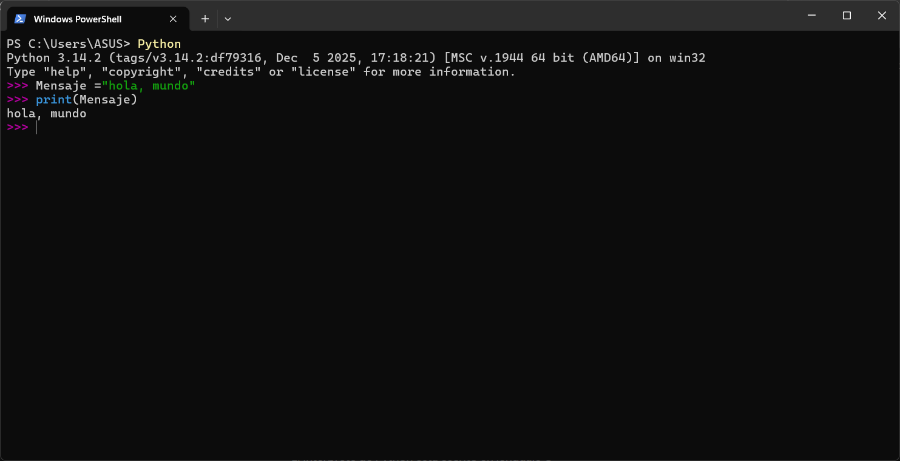

# 1.6. Terminología: intérprete y compilador

## 📚 Resumen: Terminología - Intérprete y Compilador

# **Lenguajes de Programación**

Python es un lenguaje de alto nivel diseñado para ser fácil de leer y escribir. Sin embargo, la CPU solo entiende código máquina (ceros y unos).


Diagrama mostrando la jerarquía desde lenguaje de alto nivel hasta código máquina

## Traductores de Código

### **🔵 Intérprete**

- Lee y ejecuta el código línea por línea
- Python es un intérprete que procesa instrucciones de forma inmediata
- Permite conversación interactiva con el programa



Captura de pantalla mostrando Python ejecutándose de forma interactiva

### **🔴 Compilador**

- Necesita el programa completo antes de traducirlo
- Convierte todo el código a código máquina de una vez
- Genera archivos ejecutables (.exe, .dll).


Diagrama comparativo entre intérprete y compilador

<aside>
😳

El intérprete de Python está escrito en lenguaje C

</aside>

# Variables en Python

Si se quiere que Python recuerde cierto valor para utilizarlo más tarde. Tenemos que escoger un **`nombre`** para que ese valor sea recordado y usaremos ese nombre simbólico para recuperar el valor más tarde. **`Utilizamos el término`** variable para denominar las etiquetas que usamos
para referirnos a esos datos almacenados.

```python
>>> x = 6
>>> print(x)
6
>>> y = x * 7
>>> print(y)
42
```

