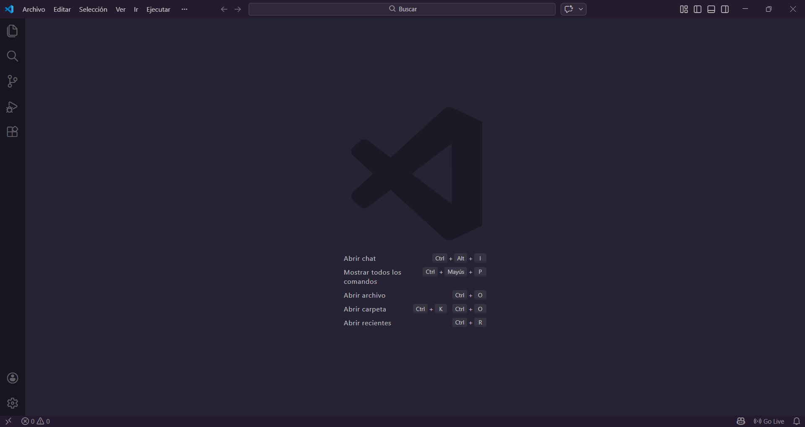

# 1.7 Escribiendo un programa

Capitulo del libro: Capítulo 1

## 📝 Escribiendo un programa en Python:

Cuando queremos escribir un programa, usamos un **`editor de texto`** para escribir las instrucciones de **`Python`** en un fichero, que recibe el nombre de **`script`**.

## **`1. Editor de código:`**

VS Code será el editor de código que se usara para escribir el script aqui abajo el link a su pagina  de descarga: 

- **Tutorial de como instalar VS CODE:**
    
    [✅ Como Descargar e Instalar Visual Studio Code (OFICIAL 2025)](https://youtu.be/6pD7_rcFrj8?si=Ake4l1M0jwBU9sho)
    
    **Fuente:**
    
    [3] Franklin Suquilanda, "✅ Como Descargar e Instalar Visual Studio Code (OFICIAL 2025)," *YouTube*, 3 de agosto de 2024. [En línea Video]. Disponible en: [https://youtu.be/6pD7_rcFrj8](https://www.google.com/search?q=https://youtu.be/6pD7_rcFrj8). [Accedido: 16 de febrero de 2026].
    

Interfaz de VSCODE.

## **`2. Creación del script:`**
[🎥 Ver video: Creación del script](./img/20260216-1727-25.3463248.mp4)

## **`3. Primera Ejecución:`**
[🎥 Ver video: Primera Ejecución](./img/20260216-1732-13.4069943.mp4)

Habrás notado que cuando trabajamos con un fichero no necesitamos incluir el comando quit() al final del programa Python. Cuando Python va leyendo tu código fuente desde un archivo, sabe que debe parar cuando llega al final del fichero.
