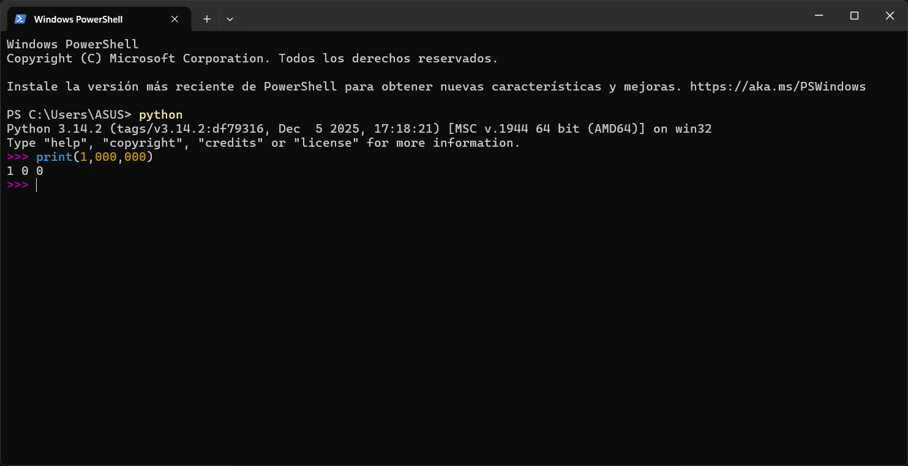

# 2.1 … 2.3 Valores, variables y palabras claves

## **2.1 Valores y tipos:**

Un **`valor`** es una de las cosas básicas que utiliza un programa, como una letra o un número (ej. 1, 2, "¡Hola, mundo!").

Estos valores pertenecen a diferentes **tipos**:

- **`Enteros (int)**:` Números sin decimales, como 2.
- **`Cadenas (str):`** Reciben ese nombre porque contienen una "cadena" de letras. Se identifican porque van entre comillas.
- **`Punto flotante (float):`** Números con punto decimal, como 3.2.

Si no estás seguro de qué tipo de valor estás manejando, el intérprete te lo puede decir utilizando la función **`type()`**

```python
>>> type('¡Hola, mundo!')
<class 'str'>
>>> type(17)
<class 'int'>
```

**`Errores semánticos comunes`:** Si intentas escribir un millón como 1,000,000, Python no dará error, pero lo interpretará como una secuencia de enteros separados por comas, imprimiendo 1 0 0.



**Errores semánticos comunes**


Tipos de datos en Python.

## **2.2 Variables**

Una de las características más potentes de un lenguaje de programación es la capacidad de manipular **`variables`**. Una variable es un nombre que se refiere a un valor.

Una sentencia de asignación crea variables nuevas y les da valores:

```python
>>> mensaje = 'Y ahora algo completamente diferente'
>>> n = 17
>>> pi = 3.1415926535897931
```

El **`tipo de una variable`** es el tipo del valor al que se refiere. Para mostrar su valor en pantalla, utilizamos la sentencia print().

## **2.3 Nombres de variables y palabras claves**

Los programadores eligen nombres para sus variables que tengan sentido y documenten para qué se usa esa variable.

**Reglas para nombrar variables:**

1. Pueden ser arbitrariamente largos.
2. Pueden contener letras y números, pero **no pueden comenzar con un número**.
3. Se permite el uso del guion bajo `"_"`, muy útil para nombres con múltiples palabras.

Si le das a una variable un nombre no permitido, obtendrás un **SyntaxError**.

>👨🏻‍🏫  
>Python reserva **`33 palabras claves`** para su propio uso. El intérprete las usa para reconocer la estructura del programa, por lo que no pueden ser utilizadas como nombres de variables

</aside>