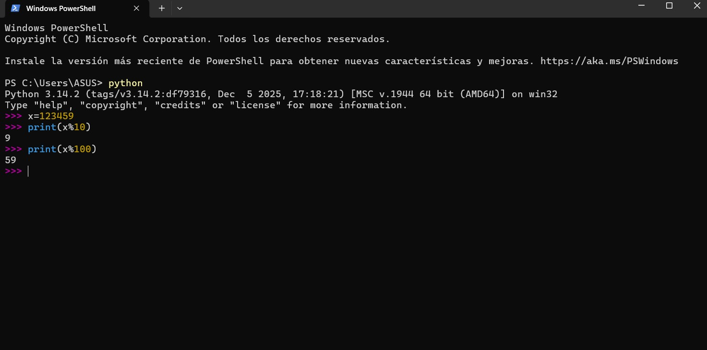
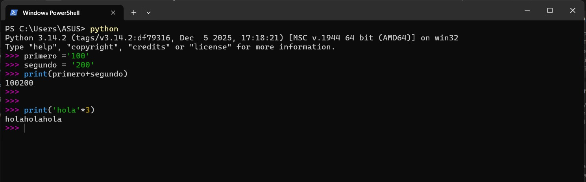

# 2.7 … 2.9 Orden de operaciones, módulo y operaciones con cadenas


## **2.7 Orden de las operaciones**

Cuando aparece más de un operador, el orden de evaluación depende de las **`reglas de precedencia`**. Python sigue las convenciones matemáticas, acrónimo **`PEMDSR`**:

1. **`Paréntesis`:** Nivel superior. Útiles para forzar el orden o facilitar la lectura.
2. **`Exponenciación`**.
3. **`Multiplicación y División`:** Tienen la misma precedencia.
4. **`Suma y Resta`:** Tienen la misma precedencia (inferior a la multiplicación).
5. Los operadores con igual precedencia se evalúan de **`izquierda a derecha`**.


## **2.8 Operador módulo**

El **operador módulo (%)** trabaja con enteros y obtiene el **resto** de una división.

```python
>>> resto= 7 % 3
>>> print(resto)
1
```

Es sorprendentemente útil. Sirve para:

- Comprobar si un número es divisible por otro (si x % y es cero).
- Extraer el último dígito de un número (x % 10) o los dos últimos (x % 100).
    
    
    

## **2.9 Operaciones con cadenas**

Los operadores matemáticos tienen comportamientos especiales cuando se aplican a cadenas de texto (str):

- **Operador `+` (Concatenación):** Une ambas cadenas, enlazando el final de la primera con el principio de la segunda.
- **Operador `*` (Repetición):** Multiplica el contenido de una cadena por un entero.

```python
>>> primero ='100'
>>> segundo = '200'
>>> print(primero+segundo)
100200
>>>
>>>
>>> print('hola'*3)
holaholahola
```

