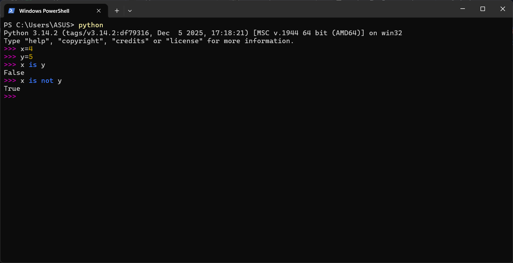
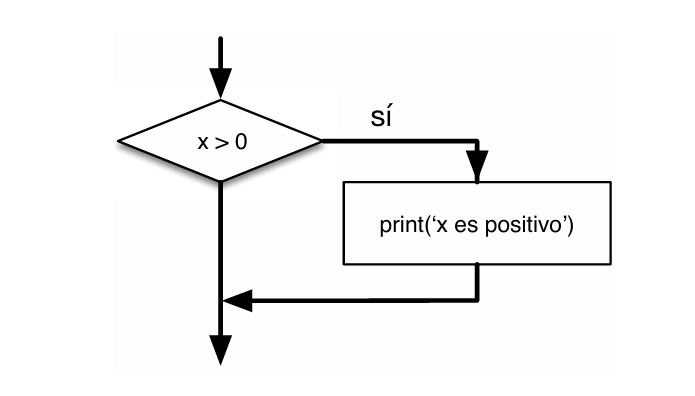

# 3.1 … 3.3 Expresiones booleanas, operadores lógicos y ejecución condicional

Capitulo del libro: Capítulo 3

# **3.1 Expresiones booleanas:**

Una **`expresión booleana`** es aquella que puede ser verdadera (**`True`**) o falsa (**`False`**). Estos son valores especiales que pertenecen al tipo **`bool`** (booleano) y no son cadenas de texto.

El operador **`==`** compara dos operandos y devuelve **`True`** si son iguales, y **`False`** en caso contrario.

```python
>>> 5 == 5
True
>>> 5 == 6
False
```

**Operadores de comparación:**

- **`!=`** (distinto de)
- **`>`** (mayor que) y **`<`** (menor que)
- **`>=`** (mayor o igual que) y <**`<=`** (menor o igual que)
- `is` (es lo mismo que) y `is not` (no es lo mismo que)
    
    
    
    Uso de “is”, “is not”
    

>👨🏻‍🏫  
>Un error muy común es usar un solo símbolo igual (`=`), que es un **operador de asignación**, en lugar de la doble igualdad (`==`), que es el **operador de comparación**.

</aside>

# **3.2 Operadores lógicos**

Existen tres operadores lógicos: **`and`** (y), **`or`** (o), y **`not`** (no). Su significado semántico es muy similar a su uso en el lenguaje cotidiano.

- **`x > 0** **and x < 10**` es verdadero **solo si** ambas condiciones se cumplen.
- **`n % 2 == 0** **or n % 3 == 0**` es verdadero **si cualquiera** de las dos es verdadera (o ambas).
- El operador **`not` niega** una expresión booleana: **`not (x > y)`** es verdadero si **`x > y`** es falso.

Curiosamente, en Python cualquier número distinto de cero se interpreta lógicamente como "verdadero".

## **Tablas de verdad de operadores lógicos**

### **Operador AND (y):**

El operador **`and`** devuelve **`True`** solo cuando **ambas** condiciones son verdaderas.

| **A** | **B** | **A and B** |
| --- | --- | --- |
| True | True | True |
| True | False | False |
| False | True | False |
| False | False | False |

### **Operador OR (o):**

El operador **`or`** devuelve **`True`** cuando **al menos una** de las condiciones es verdadera.

| **A** | **B** | **A or B** |
| --- | --- | --- |
| True | True | True |
| True | False | True |
| False | True | True |
| False | False | False |

### **Operador NOT (no):**

El operador **`not`** **invierte** el valor de verdad de una expresión booleana.

| **A** | **not A** |
| --- | --- |
| True | False |
| False | True |

# **3.3 Ejecución condicional**

Para escribir programas útiles necesitamos comprobar condiciones y cambiar el comportamiento del programa. Esto se logra con las **`sentencias condicionales`**, siendo la más sencilla la sentencia **`if`**.

```python
if x > 0 :
    print('x es positivo')
```

La expresión booleana que va después del `if` se llama **`condición`**. La sentencia debe finalizar con dos puntos (`:`) y las líneas siguientes deben ir **indentadas** (con espacios o tabulación).

Si la condición es `True`, la sentencia indentada se ejecuta. Si es `False`, se omite. Si necesitas crear un bloque `if` vacío temporalmente (código en construcción), puedes usar la sentencia **`pass`**, que no hace absolutamente nada.

