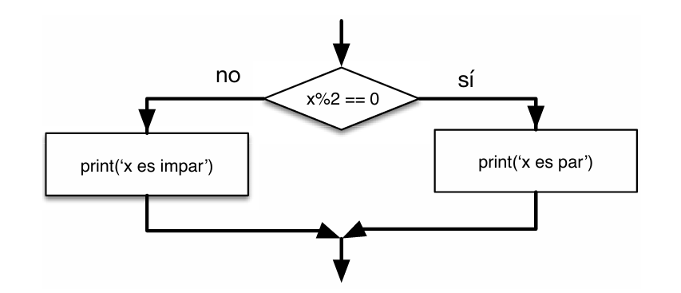
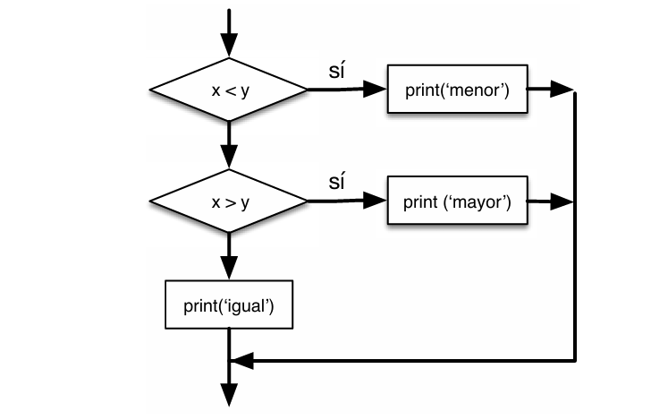
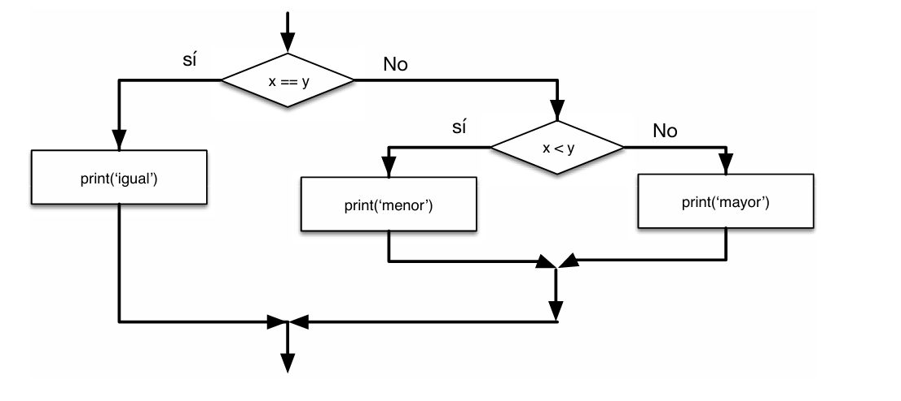

# 3.4 … 3.6 Ejecución alternativa, condicionales encadenados y anidados

Capitulo del libro: Capítulo 3

# **3.4 Ejecución alternativa**

La segunda forma de la sentencia `if` es la **`ejecución alternativa`**. Existen dos posibilidades y la condición determina cuál se ejecutará. Para esto utilizamos **`else`**:

```python
if x % 2 == 0:
    print('x es par')
else:
    print('x es impar')
```

Como la condición solo puede ser obligatoriamente verdadera o falsa, **solamente una de las alternativas será ejecutada**. Estas alternativas reciben el nombre de **`ramas`**.



# **3.5 Condicionales encadenados**

Cuando hay más de dos posibilidades, necesitamos más de dos ramas usando un **`condicional encadenado`** con la palabra reservada **`elif`** (abreviatura de "else if").

```python
if x < y:
    print('x es menor que y')
elif x > y:
    print('x es mayor que y')
else:
    print('x e y son iguales')
```

No hay límite para el número de sentencias **`elif`**. Si decides incluir un **`else`**, debe ir obligatoriamente al final. Las condiciones se comprueban en orden y **solo se ejecuta la primera rama que sea verdadera**, ignorando el resto.



# **3.6 Condicionales anidados**

Un condicional puede estar **anidado** dentro de otro (uno dentro de las ramas de otro).

```python
if x == y:
    print('x e y son iguales')
else:
    if x < y:
        print('x es menor que y')
    else:
        print('x es mayor que y')
```

Aunque la indentación ayuda a que la estructura sea clara, los condicionales anidados pueden volverse difíciles de leer muy rápido. **En general, es buena idea evitarlos** usando operadores lógicos (`and`) cuando sea posible.

