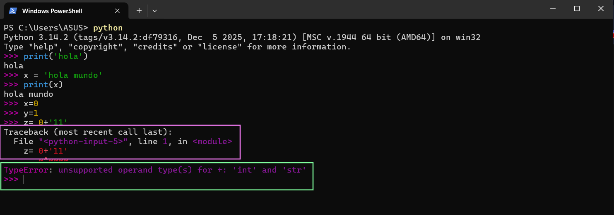

# 3.7 … 3.9 Try/Except, cortocircuito y depuración

Capitulo del libro: Capítulo 3

# **3.7 Captura de excepciones usando try y except**

Funciones como **`int()`** fallarán si el usuario introduce letras en lugar de números, generando un error (**`ValueError`**) que detendrá el programa por completo.

Python ofrece la estructura **`try / except`** para manejar estos errores. Funciona como una "póliza de seguros": pones el código que podría fallar dentro del bloque **`try`**, y si ocurre un error, Python en lugar de detenerse salta al bloque **`except`** y ejecuta el código alternativo.

```python
ent = input('Introduzca la Temperatura Fahrenheit:')
try:
    fahr = float(ent)
    cel = (fahr - 32.0) * 5.0 / 9.0
    print(cel)
except:
    print('Por favor, introduzca un número válido.')
```

Gestionar una excepción de esta forma se llama **capturar una excepción**, lo que nos permite terminar el programa con elegancia en lugar de mostrar errores técnicos al usuario.


# **3.8 Evaluación en cortocircuito de expresiones lógicas**

Cuando Python evalúa expresiones lógicas de izquierda a derecha, se detiene en el momento que ya conoce el valor final. Esto se conoce como **`cortocircuitar la evaluación`**.

Por ejemplo, en la expresión **`x >= 2`** **`and` `(x/y) > 2`**: si **`x`** es `1`, la primera condición ya es falsa. Por lo tanto, toda la expresión conectada por `and` será falsa sin importar el resto. Python se da cuenta de esto y **no evalúa la segunda parte**.

Esto nos permite usar una técnica llamada **`patrón guardián`**. Podemos poner una evaluación de "guardia" antes de algo que podría dar un error matemático (como dividir por cero):

```python
>>> x = 1
>>> y = 0
>>> x >= 2 and y != 0 and (x/y) > 2
False
```

Aquí, `y != 0` actúa como guardián para proteger la operación `(x/y)` de un error en tiempo de ejecución.

# **3.9 Depuración:**

Los mensajes de error (**`Tracebacks`**) contienen mucha información, pero las partes más útiles son:

1. **Qué tipo de error** se ha producido.
2. **Dónde ha ocurrido**.

Los errores de sintaxis pueden ser engañosos. Por ejemplo, un `IndentationError` o un error por dejar espacios en blanco incorrectos a veces señalan a una línea que está bien, pero el error real ocurrió en el código previo.

Igualmente ocurre con los errores en tiempo de ejecución (ej. dividir accidentalmente por enteros en lugar de valores de punto flotante); Python apuntará al momento donde falló la operación, pero la raíz del error suele estar en la configuración de las variables unas líneas más arriba.

