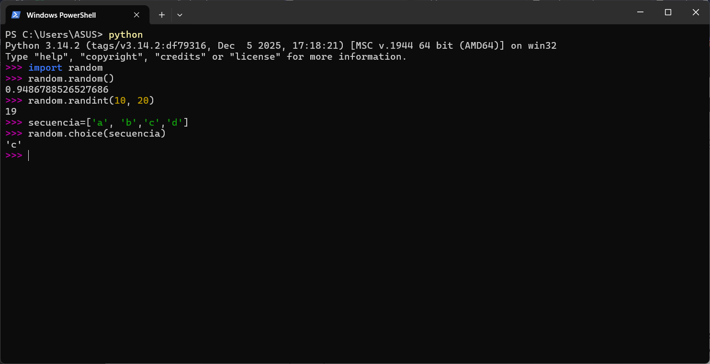

# 4.4 … 4.6 Funciones matemáticas, números aleatorios y añadiendo funciones nuevas

Capitulo del libro: Capítulo 4

# **4.4 Funciones matemáticas**

Python tiene un módulo llamado **`math`** que proporciona la mayoría de las funciones matemáticas habituales. Para usarlo, primero debemos importarlo:

```python
>>> import math
```

Esto crea un objeto módulo. Para acceder a sus funciones, se usa la **`notación punto`** (nombre del módulo seguido de un punto y el nombre de la función o variable).

```python
>>> relacion = int_senal / int_ruido
>>> decibelios = 10 * math.log10(relacion)

>>> radianes = grados / 360.0 * 2 * math.pi
>>> math.sin(radianes)
```

>👨🏻‍🏫  
>El módulo `math` incluye constantes como `math.pi` y funciones trigonométricas (que siempre toman argumentos en radianes).


# **4.5 Números aleatorios**

La mayoría de los programas son **deterministas** (las mismas entradas generan las mismas salidas). Para conseguir un comportamiento no-determinista (útil en juegos o simulaciones), usamos números **`pseudoaleatorios`**.

El módulo **`random`** proporciona funciones para generarlos:

- **`random.random()`**: Devuelve un número flotante entre 0.0 y 1.0 (sin incluir el 1.0).
- **`random.randint(inferior, superior)`**: Devuelve un número entero entre los límites especificados (incluyendo ambos extremos).
- **`random.choice(secuencia)`**: Elige aleatoriamente un elemento de una lista o secuencia.




# **4.6 Añadiendo funciones nuevas**

Podemos crear nuestras propias funciones utilizando la palabra clave **`def`**. Esto nos permite reutilizar código a lo largo del programa.

```python
def muestra_estribillo():
    print('Soy un leñador, qué alegría.')
    print('Duermo toda la noche y trabajo todo el día.')
```

- **La cabecera:** Es la primera línea, comienza con **`def`**, incluye el nombre de la función, paréntesis y termina obligatoriamente con dos puntos (**`:`**).
- **El cuerpo:** Es el resto de la función, el cual **debe ir indentado** (usualmente con 4 espacios).

>👨🏻‍🏫  
>Al definir una función, se crea un *objeto función*. Para ejecutar su código, debemos llamarla usando la misma sintaxis que con las funciones internas. 
